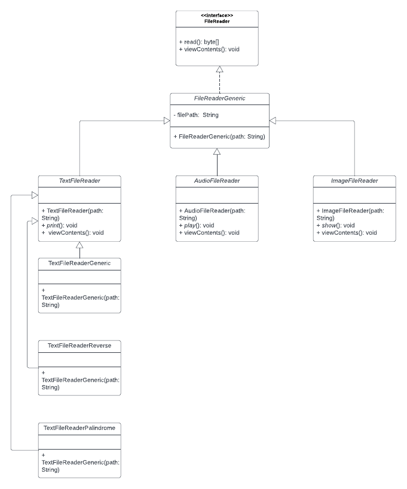

# Lecteur de fichiers

Le but de ce projet est de pratiquer la notion d'héritage objet
à travers la réalisation d'un lecteur de fichiers.

## Conception

Comme requit, ce projet:
- définit une interface de lecteur de fichier, `FileReader`  
- définit des sous-classes abtraites correspondant à différents types de fichiers
    - `TextFileReader`
    - `AudioFileReader`
    - `ImageFileReader`
- implémente 3 types de lecteurs de fichiers textes
    - `TextFileReaderGeneric`
    - `TextFileReaderReverse`
    - `TextFileReaderPalindrome`

Voici le schéma UML



## Compilation

Le point d'entré du programme étant dans la fonctione main de la classe Main, c'est le fichier Main.java qui nous intéresse.

```
javac Main.java
```

## Utilisation

```
java Main
```

## Details de l'implémentation

Les détails de l'implémentation sont développés dans les commentaires de mon code.

